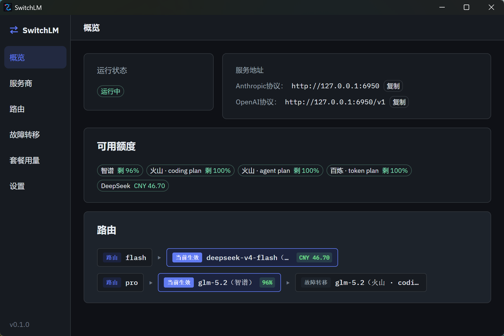
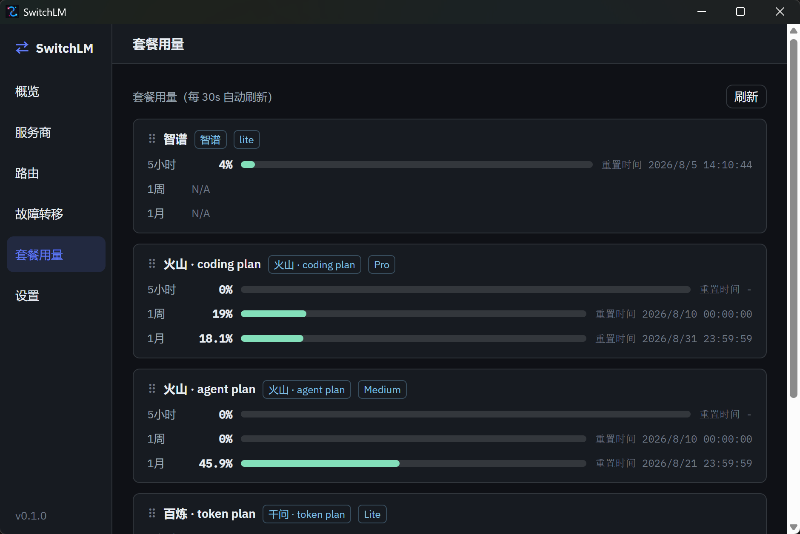
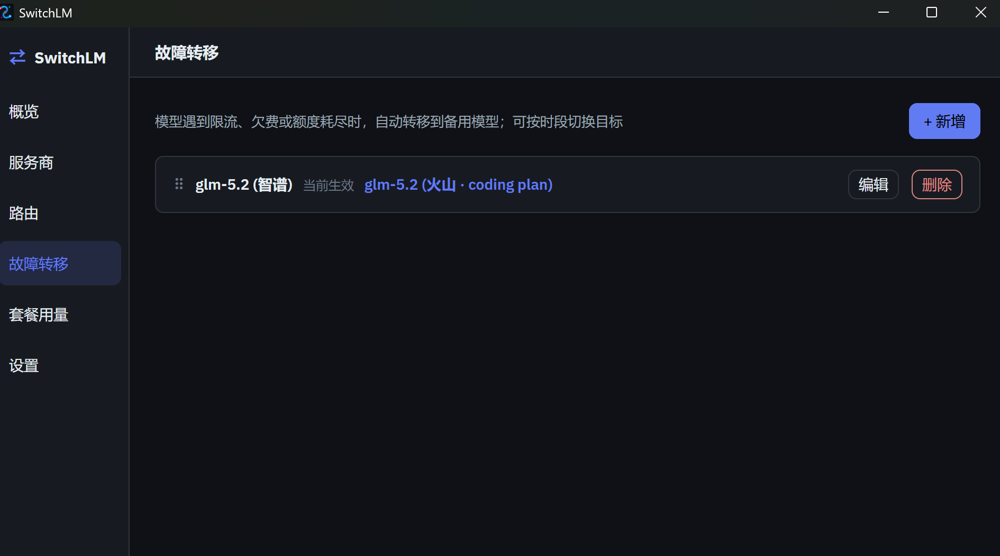
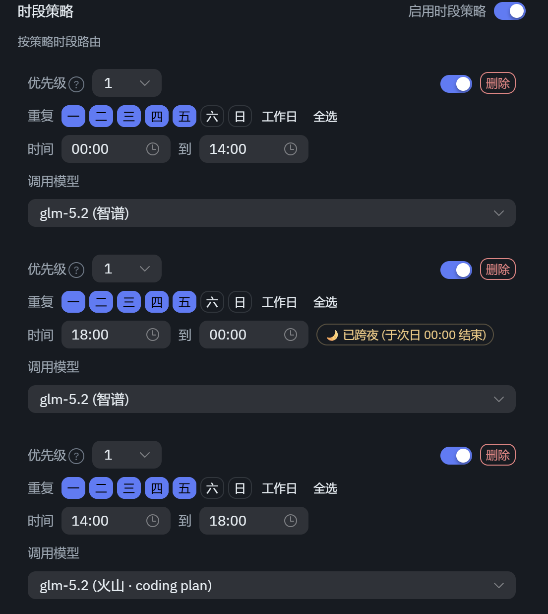
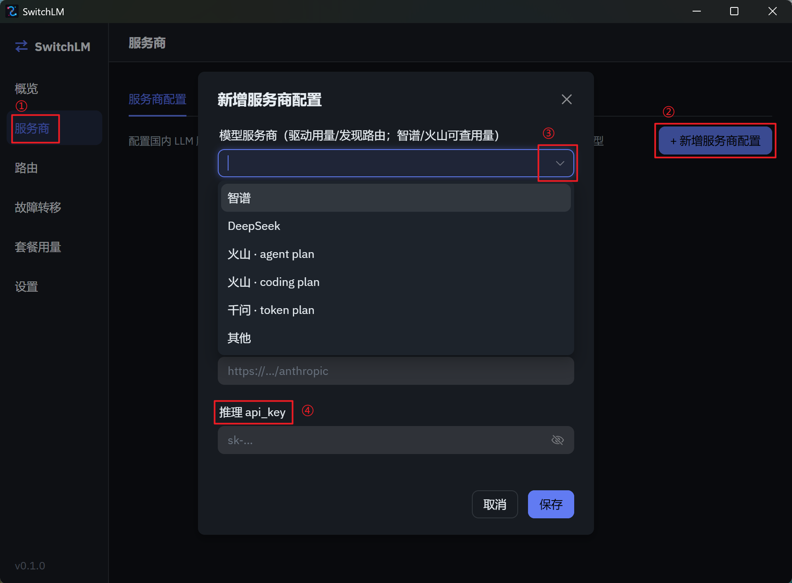
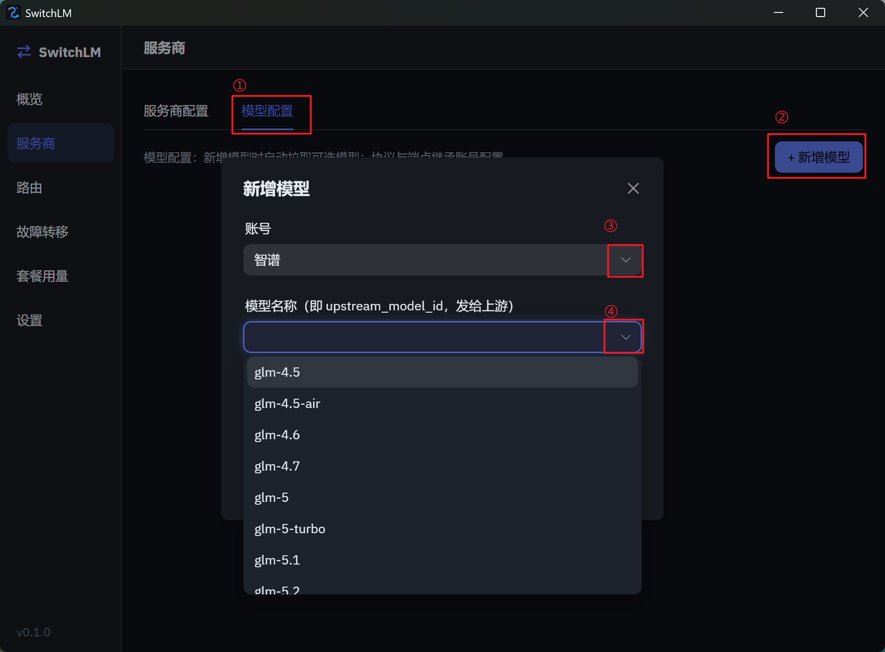
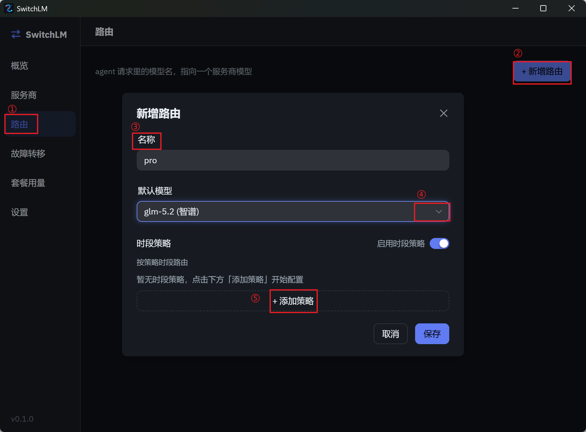
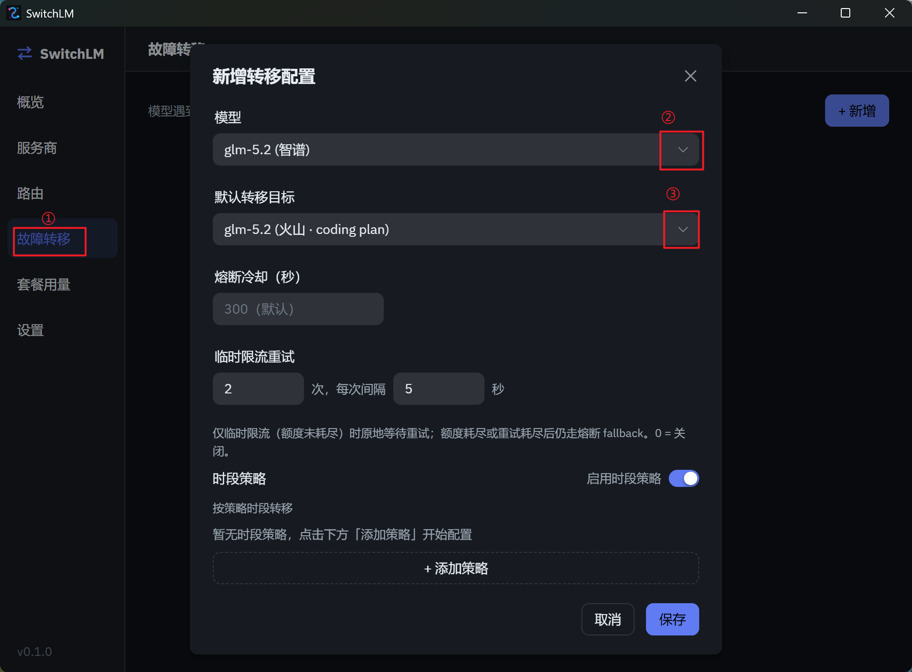

# SwitchLM

[](LICENSE)

> 一个多编程套餐管理工具，可以同时管理不同厂商的编程套餐，按策略进行调度，让智能体在多个厂商套餐中无缝切换。

## 解决什么问题

国产大模型厂商（智谱 GLM、阿里云百炼/通义千问、火山方舟、DeepSeek 等）普遍推出**编程套餐**：包月/包周/5 小时窗口的额度，不同套餐的计费窗口、闲时优惠各不相同——有的夜间打折、有的忙时加价，同时持有多个套餐时，如何把每份优惠都吃满就成了问题。

SwitchLM 解决的核心问题是：**拥有多个服务商编程套餐时，按「时间 + 限额」自动切换分发策略，在不同服务商模型之间无感切换，最大化利用不同套餐的优惠。** 例如：

- **按套餐优先级切换**：优先使用智谱套餐，额度耗光后自动切到其他套餐继续跑，不打断任务。
- **按时段切换**：配置夜间优先使用千问套餐（夜间打折）、下午不用智谱套餐（高峰加价），其余时间走默认模型。

## 为什么再造一个轮子

先尝试了市面上常见的模型管理工具，但没有找到一款能**按时间配置模型分发策略**的小工具：有提供类似功能的工具往往比较重，有一定的学习成本在。于是自己实现了一个足够简单的——桌面托盘应用，启动即起代理，专注「按时间、按照套餐优先级自动分发」这一个场景，开箱即用。

## 页面演示

|||
| :---------------------------------------: | :------------------------------------------: |
|                  主界面                   |                 用量显示                   |
|  |  |
|失败转移|策略配置|
|||

---

## 快速使用

### 安装
SwitchLM 从[release页面](https://github.com/thecrackofdawn/SwitchLM/releases)下载最新版本，当前提供了windows和linux安装包。

### 配置指导
#### 添加服务商

#### 添加模型

这里一定要记住添加模型，只有在这里添加了模型后，才能在路由跟故障转移页面选择到相应的模型。

#### 添加路由


这里的路由名称“pro”，就是需要配置在智能体的模型名称。

#### 配置失败回退

这里配置当一个模型额度耗尽后，可以回退调用其他模型。

#### 接入编程 Agent

完成上面的「添加服务商 → 添加模型 → 添加路由」配置后，把 Agent 的接口地址指向本地代理（默认端口 `6950`），模型名填你配置的路由名称（如上面的 `pro`）：

- **Claude Code**（Anthropic 协议）：
  ```bash
  export ANTHROPIC_BASE_URL=http://localhost:6950
  export ANTHROPIC_AUTH_TOKEN=<任意非空字符串>
  ```
  Windows PowerShell 下：
  ```powershell
  $env:ANTHROPIC_BASE_URL = "http://localhost:6950"
  $env:ANTHROPIC_AUTH_TOKEN = "任意非空字符串"
  ```
- **Cursor / Cline 等**（OpenAI 协议）：Base URL 填 `http://localhost:6950/v1`，模型名填你配置的路由名称（或其别名）。

> Agent 发送的模型名会先解析为路由（Profile），再映射到背后的真实模型与上游厂商。路由支持配置别名（如 `claude-sonnet-4`），让 Agent 无需改动模型名即可走代理。

---

## 本地编译
### 前置依赖（Windows）

- [Node.js](https://nodejs.org/) ≥ 20
- [Rust](https://rustup.rs/) 工具链（stable）
- Microsoft C++ Build Tools（MSVC，随 Visual Studio Build Tools 安装）
- WebView2（Win10/11 通常已自带）

### 前置依赖（Linux）

Tauri v2 在 Linux 上依赖 WebKitGTK 与若干系统库。以 Debian/Ubuntu 为例：

```bash
sudo apt install -y libwebkit2gtk-4.1-dev libgtk-3-dev libayatana-appindicator3-dev \
  librsvg2-dev libdbus-1-dev patchelf
```

Fedora：

```bash
sudo dnf install -y webkit2gtk4.1-devel gtk3-devel libayatana-appindicator-devel \
  librsvg2-devel dbus-devel patchelf
```

另需 Node.js ≥ 20、Rust stable（同 Windows）。另见下方“Linux 运行注意事项”。

### 构建与运行

```bash
npm install            # 安装前端依赖
npm run tauri dev      # 开发模式，热重载
npm run tauri build    # 产出安装包（位于 src-tauri/target/release/bundle/）
```

> **Linux 打包**：`npm run tauri build -- --bundles deb,rpm` 产出 `.deb`/`.rpm`（位于 `src-tauri/target/release/bundle/`）；安装包已声明运行期依赖，安装时会自动拉取 WebKitGTK / appindicator / libdbus。

#### Linux 运行注意事项

- **系统托盘**：GNOME（尤其 Wayland）默认无传统托盘，需安装 *AppIndicator and KStatusNotifierItem Support* 扩展；无托盘的环境下关闭窗口将隐藏，再次启动应用（单实例会聚焦既有窗口）即可恢复。
- **密钥存储**：建议运行 gnome-keyring / KWallet；**未安装密钥环**时首次启动会弹出对话框询问是否将访问密钥以明文存入 `~/.local/share/com.switchlm.app/secrets.json`（文件权限 0600）。同意即用文件存储，退出则不保存。需要更安全的存储请安装密钥环。
- **不支持 headless / 无桌面服务器**（这是桌面托盘应用）。

## 开发与测试

```bash
cargo test --manifest-path src-tauri/Cargo.toml   # 后端测试
npm run build                                      # 前端类型检查 + 构建
```

## Roadmap / TODO

- [ ] **套餐支持并发配置**：为每个套餐/账号配置最大并发请求数，并提供合理默认值（应对套餐的并发上限，避免无谓的 429）。
- [ ] **添加sk-xxx认证**：用于团队套餐管理，服务化部署，多人同时访问。
- [ ] **辅助自动化配置常见编程智能体**：用户帮助用户快速配置，使用本应用提供的代理模型
- [ ] **请求缓存**：需要先验证下作为本地转发器缓存请求是否有收益
- [ ] **加入token消耗统计**：加入token消耗统计
- [ ] **不显示UI时销毁页面**：减少常驻内存占用
